# Функциональные баги (фильтрация и логика поиска)
## **1. Фильтр по городу не работает**
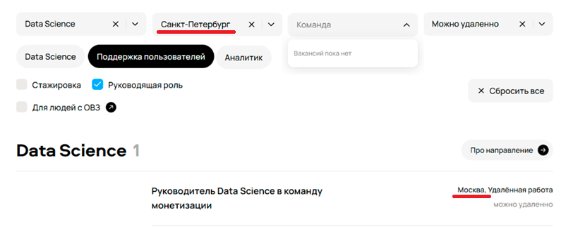

📌 High

📝 При выборе «Санкт-Петербург» в выдаче отображаются вакансии из Москвы и других городов. Нет отсечения по локации.

🔍 Город — базовый параметр поиска работы. Неработающий фильтр делает поиск нерелевантным и нарушает основную бизнес-функцию сайта.

## **2. Фильтр «Можно удаленно» не отсекает офисные вакансии**
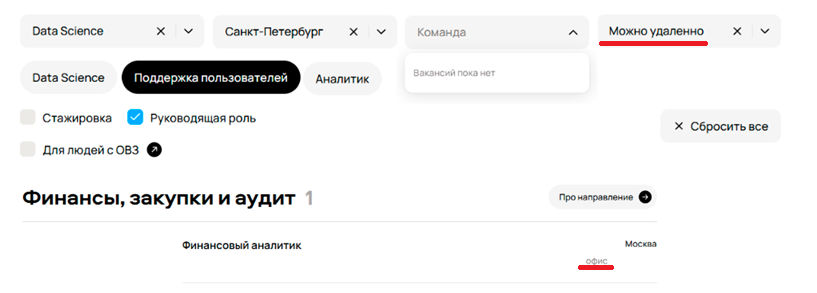

📌 High

📝 При активации фильтра «Можно удаленно» в выдаче присутствуют вакансии только с пометкой «офис» или «Москва, офис», без упоминания удалёнки.

🔍 Фильтр вводит в заблуждение: пользователь, ищущий удалёнку, получает неподходящие предложения. Критически снижает доверие к фильтрации.

## **3. Фильтр по направлению (например, «Data Science») показывает вакансии из других направлений**
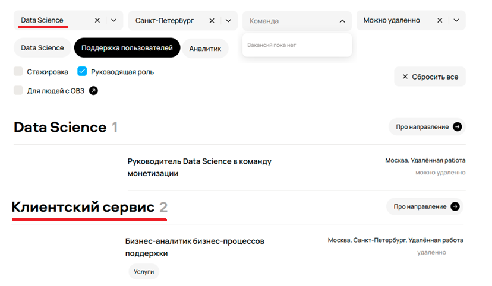

📌 High

📝 При выборе направления «Data Science» отображаются секции «Клиентский сервис», «Финансы…» и др., содержащие непрофильные вакансии (например, аналитики поддержки).

🔍 Нарушена логика категоризации — пользователь не может сузить поиск по специализации. Это портит ключевой сценарий использования.

## **4. Фильтр «Руководящая роль» не отсеивает неруководящие позиции**
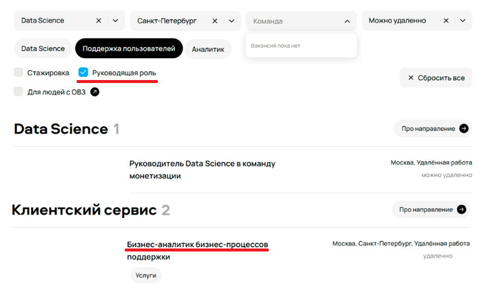

📌 High

📝 В выдаче есть явно не-руководящие вакансии («Бизнес-аналитик») при включённом фильтре «Руководящая роль».

🔍 Фильтр не выполняет свою функцию, что делает поиск по карьерному уровню бессмысленным.

## **5. Чип-фильтр «Поддержка пользователей» показывает нерелевантные вакансии**
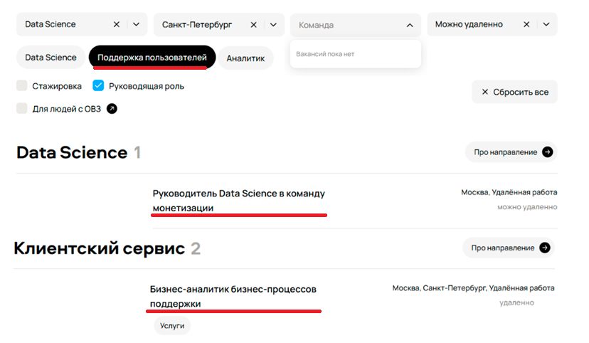

📌 High

📝 В результатах чипа «Поддержка пользователей» есть вакансии, не относящиеся к поддержке (например, бизнес-аналитики процессов).

🔍 Некорректная семантическая привязка фильтров снижает точность поиска и вызывает недоверие.

## **6. Выпадающий список «Команда» показывает сообщение «Вакансий пока нет»**
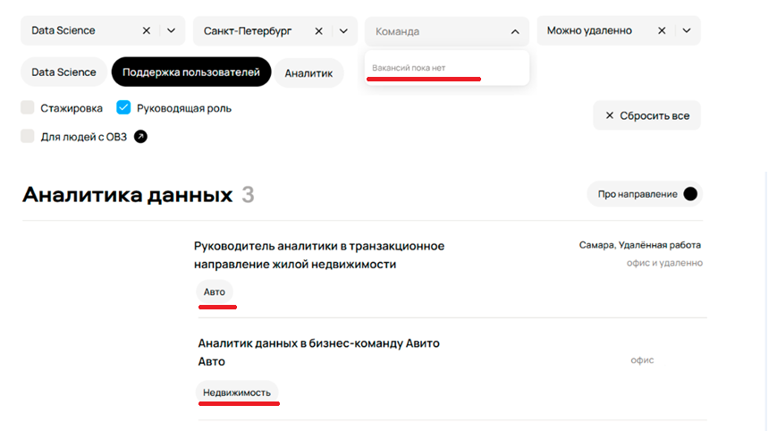

📌 High

📝 При наличии вакансий с явными лейблами команд («Авто», «Недвижимость») фильтр «Команда» не предлагает выбор — только заглушка.

🔍 Отсутствие фильтра по команде (при наличии данных для него) — пропущенная возможность точной настройки поиска, критично для UX.

## **7. Сообщение «Ничего не нашлось» отображается при наличии вакансий**
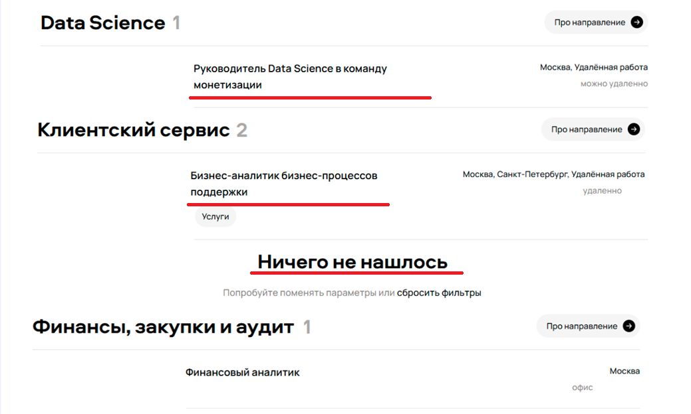

📌 High

📝 В центре страницы отображается блок «Ничего не нашлось», хотя ниже есть несколько секций с вакансиями.

🔍 Прямое противоречие: система сообщает об отсутствии результатов, хотя они есть. Это убивает доверие и может привести к уходу пользователя.

# Данные и их отображение
## **8. Некорректный счётчик вакансий в разделе (например, «Клиентский сервис 2» → 1 вакансия)**
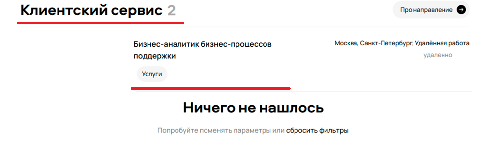

📌 Medium

📝 В заголовке раздела указано «2», но отображается только одна вакансия.

🔍 Ошибка в подсчёте вызывает сомнения в надёжности системы, но не блокирует поиск.

## **9. У офисных вакансий отсутствует город**
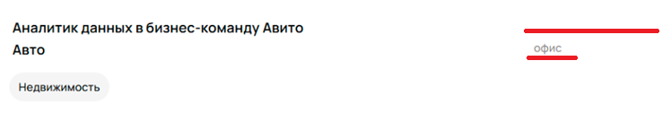

📌 Medium

📝 Например, вакансия «Аналитик данных в бизнес-команду Авито» — указано «офис», но не указан город.

🔍 Для офисных позиций город — критическая информация. Его отсутствие затрудняет принятие решения, но не ломает функционал полностью.

## **10. Формат работы «Удалённая работа» фигурирует в списке городов**
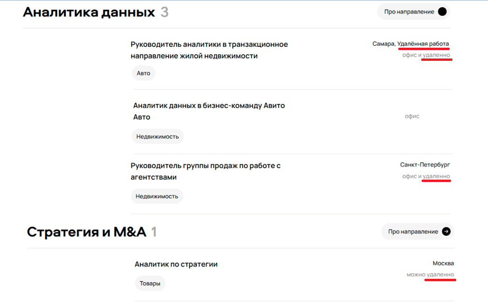

📌 Medium

📝 В выпадающем списке городов встречается пункт «Удалённая работа» — смешение сущностей: локация vs формат работы.

🔍 Нарушает семантическую целостность фильтров. Пользователь может ошибочно выбрать «город» как «Удалённая работа».

## **11. Не у всех вакансий указан лейбл команды, хотя команда есть**
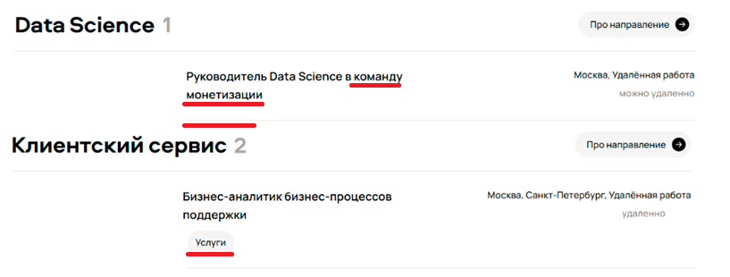

📌 Medium

📝 Некоторые карточки содержат лейблы («Авто»), другие — нет, хотя контекст подразумевает принадлежность к команде.

🔍 Нарушена консистентность данных, что снижает качество поиска по командам.

## **12. Несоответствие команды в названии вакансии и её лейбле**

📌 Medium

📝 Например: вакансия «в Авито Авто» → лейбл «Недвижимость», и наоборот.

🔍 Подрывает доверие к точности описаний: соискатель не может понять, в какую команду он попадёт.

# UI / UX / Визуальные несоответствия
## **13. Отсутствует иконка на кнопке «Про направление» (стрелка)**
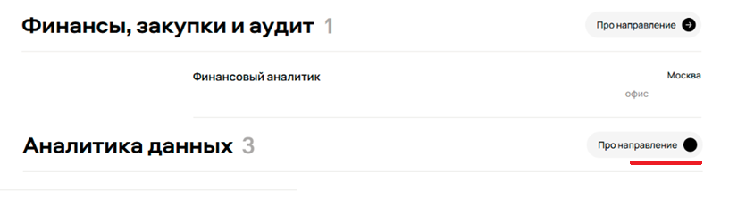

📌 Low

📝 В заголовке «Аналитика данных» кнопка без стрелки, в отличие от других разделов.

🔍 Чисто визуальный дефект; не влияет на функционал, но нарушает единообразие.

## **14. Непрогруженная иконка очистки в поле поиска (битый крестик)**
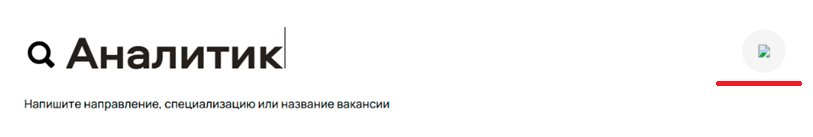

📌 Medium

📝 В поле поиска отображается placeholder изображения вместо крестика. Функция может работать, но элемент неочевиден.

🔍 Ухудшает доступность интерфейса: пользователь не узнаёт интерактивный элемент. Однако текст можно удалить вручную — поэтому Medium.

## **15. Разное выравнивание / отступы / стиль у лейблов формата работы**
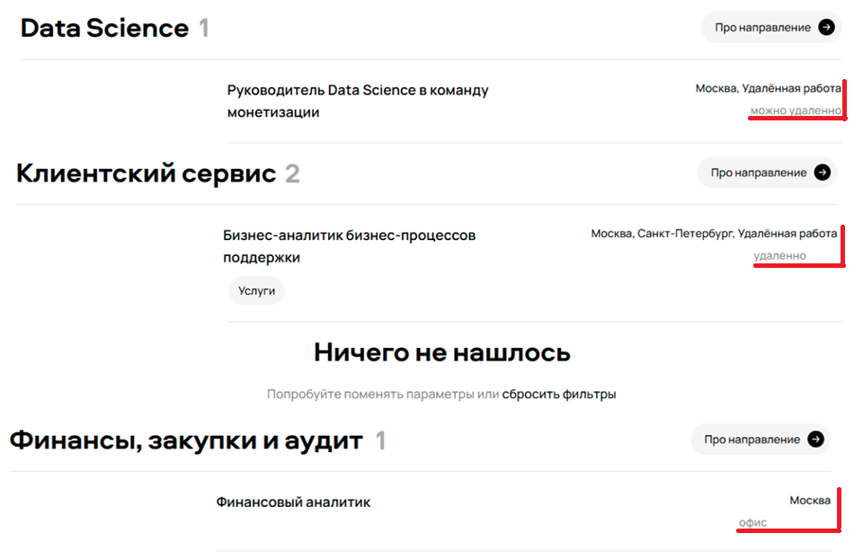

📌 Low

📝 На одних карточках лейбл выровнен по центру, на других — по левому краю; разные отступы.

🔍 Чисто косметический недочёт, не влияющий на функциональность.

## **16. Проблемы с версткой (блоки не по сетке)**
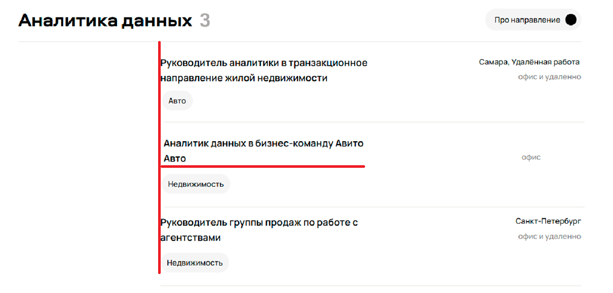

📌 Low

📝 Небольшие смещения элементов, заметно в блоке "Аналитика данных", по второму заголовку.

🔍 Портит визуальное восприятие, но не влияет на содержание.

# Текстовые и грамматические ошибки
## **17. Грамматическая ошибка: «227 вакансии открыто»**
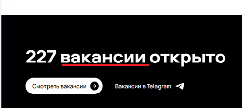

📌 Low

📝 Должно быть: «227 вакансий открыто».

🔍 Ошибка в согласовании числительного и существительного. Не мешает пониманию, но снижает профессиональное впечатление.

## **18. Опечатка: «Telagram» вместо «Telegram»**
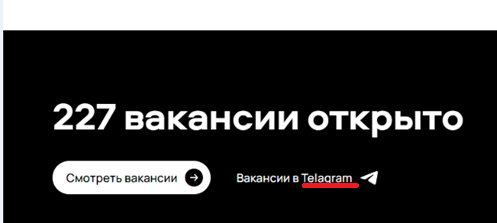

📌 Low

📝 В футере ссылка на вакансии в «Telagram», должно быть «Telegram».

🔍 Явная опечатка в узнаваемом бренде — косметическая, но бросается в глаза.

## **19. Некорректный адрес московского офиса: «Лесная, 77»**

📌 Medium

📝 Реальный адрес — «Лесная, 7». Ошибка может сбить с толку кандидата, желающего посетить офис.

🔍 Не влияет на поиск вакансий, но портит доверие к достоверности информации компании.